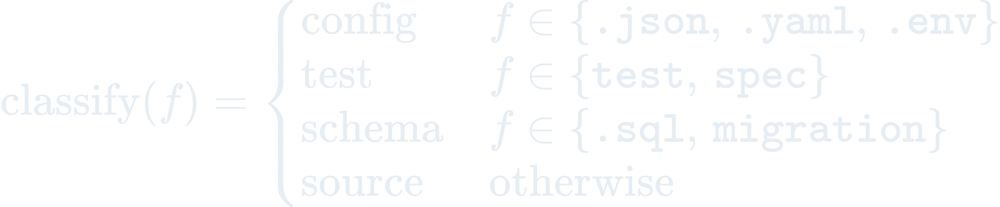

# The Science Behind Crow

Formal mathematical models powering every change-trust engine in Crow.

These aren't abstractions. Every formula maps to running code.

---

## H1. Semantic Diff Analysis

**Problem:** Classify and compress every change into semantic hunks — addition, deletion, modification, or refactor — so the downstream trust engine can weight them correctly.

Parses unified diffs hunk-by-hunk. Change type inherits semantics from file extension and path (source, test, config, schema, dependency, docs). Refactor detection uses Python `SequenceMatcher.ratio()` on before/after text with a 0.6 cutoff. Hunks in the same directory cluster into a single logical change. Counts feed a 4-level complexity bucket (none / low / medium / high) that drives the severity of downstream signals.

**Implementation:** `plugins/change-tracker/hooks/post-tool-use/track-change.sh`, `shared/scripts/diff-analyzer.py`

---

## H2. Content-Detector Suite

**Problem:** Surface a per-file risk signal after every write, so a developer is warned when a change matches a known dangerous pattern.

Crow runs a **stateless content-detector suite** on each Write/Edit. The file's content is scanned for red-flag patterns; each matched pattern appends a flag, and the change's **severity** is the maximum over the flags that fired:

| Severity | Flags |
|----------|-------|
| CRITICAL | `exposed_secrets`, `gutted_test` |
| HIGH | `weak_crypto`, `wildcard_cors` |
| WARNING | `trivial_assertions`, `very_short_file`, `debug_enabled`, `reverted` |
| clean | no flag fired |

There is **no trust score and no cross-session accumulation**. A previous version computed a "Beta-Bernoulli posterior trust" — but it fed a *file-type lookup constant* into the Bayesian update as if it were an observation. Because every update used the same constant `ℓ` for a given type, the posterior mean `(2 + Σℓ)/(4 + n)` simply converged to that constant and the HIGH band (≥ 0.8) was mathematically unreachable for source/schema/dependency/config changes. The number carried no information beyond the file type, so it was removed. The flags — which are derived from the actual content — are the signal.

A genuine survival-based trust metric (does a change persist, or get reverted/reworked over the following commits?) would be a separate, git-ground-truth rebuild. It is **not** built here; this section documents the honest detector suite that ships today.

**Implementation:** `plugins/trust-scorer/hooks/post-tool-use/score-change.sh`, `shared/scripts/trust-model.py`

---

## H3. Severity-Ordered Review

**Problem:** When several changes are flagged, decide which to review first.

Flagged changes are ordered by severity (CRITICAL → HIGH → WARNING); clean changes are not surfaced. This replaces an earlier information-gain (binary-entropy) ordering that ranked files by the uncertainty `H(p)` of their trust score — a computation that required a trust probability `p`. With the trust score removed (see H2), there is no `p` to take the entropy of, so the entropy lookup table and the IG ordering were removed. Severity is a direct, honest ordering over the flags that actually fired.

**Implementation:** `plugins/decision-gate/hooks/post-tool-use/gate-change.sh`

---

## H4. Session Continuity Graph

**Problem:** Build a reusable cross-session graph of file/cluster/review state before context compaction wipes the transcript.

H4 is structural, not closed-form. The graph `G = (nodes, edges)` has per-file nodes `(file, type, change_count, last_hash, cluster_id)` and per-cluster edges `(cluster_id, file_list)`. The serialized object adds session metadata: `{ ts, session_hash, total_changes, severity_dist, reviews, nodes[0:50], edges[0:20] }`.

The `save-session.sh` hook (PreCompact) gathers the 200 most recent changes from `change-tracker`, the per-file detector flags from `trust-scorer`'s session cache, and recent decisions from `decision-gate`. Groups by `cluster_id` to identify architectural regions. Emits both `session-graph.json` and a human-readable `session-summary.md`, both capped at 50 KB for compaction survival. The restorer agent rebuilds context on resume without re-scanning the repo.

**Implementation:** `plugins/session-memory/hooks/pre-compact/save-session.sh`

---

## H5. Adversarial Self-Review

**Problem:** For flagged changes, surface targeted questions that catch common omissions — gutted tests, removed auth, exposed secrets — immediately after the write executes.

H5 is dispatch logic, not closed-form. Trigger rule: `if severity != clean then emit Q(change_type); exit 0` (advisory only). Cooldown: skip advisory for the next 3 turns after issuing one.

Maps change type to a curated question set: `config → "secrets/env overrides?"`, `test → "assertion weakening?"`, `source → "regression/auth loss?"`, `schema → "reversible/consumer breakage?"`. PostToolUse runs immediately after the write hits disk, giving the developer a chance to reconsider before downstream changes compound. The 3-turn cooldown prevents question fatigue.

**Implementation:** `plugins/decision-gate/hooks/post-tool-use/gate-change.sh`

---

## H6. Exponential Strategy Averaging (EMA Accumulation)

**Problem:** Track cross-session developer patterns — which change types persistently trip detectors, which reviewers get overridden — to surface coachable patterns.

Per change type (source, test, config, docs, schema, dependency), maintains a running EMA of the **flag rate** (`flag_rate` — the fraction of changes of that type that raised at least one detector flag) and review frequency (`review_rate`). Alpha = 0.3 favors recent signals while preserving history. The flag rate is an honest observable — how often a change type actually trips a content detector — not a Bayesian trust score. Chronic patterns — a flag rate persistently above 0.5 for three or more sessions — emit an alert in `learnings.json` so the next session can surface them.

**Implementation:** `shared/scripts/learnings.py`

---

*Every formula maps to executable code in the enchanter-ai ecosystem. The math runs.*
